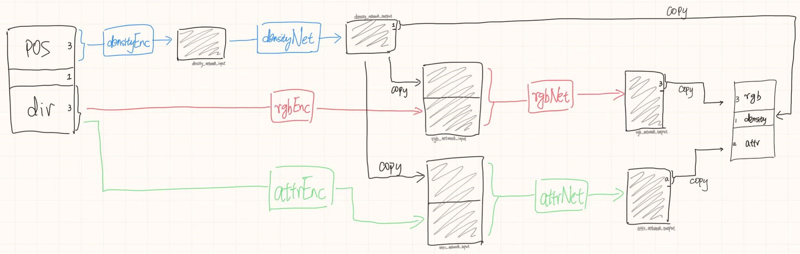

# Advanced Instant Neural Graphics Primitives

this repository tries to add more function supports to instant-ngp in a pure CUDA C++ level

modification is based on [instant-ngp d9e9bff](https://github.com/NVlabs/instant-ngp/tree/d9e9bff0925d7e4d2fe0b8e8d16ab0cee94468b6) 

**Work in Progress**

# What has been Removed Compared to the Official Implementation?

**Only Support/Allow:**
- only NeRF (intentionally remove other primitives)
- no GUI (for fast experiment)
- build on Linux with Python (because most people use Linux's Python)
- no DLSS, no OptiX (useless, so remove them)

TODO
- [ ] extra attribute rendering

# Installation

```bash
git clone git@github.com:Karbo123/instant_nerf.git --depth=1
cd instant_nerf
git submodule update --init --recursive
ln -s `pwd`/third_party/instant-ngp/dependencies `pwd`/model
cd model && source build.sh
```

# What is New?

## New Network Architecture
It may look like this: 

